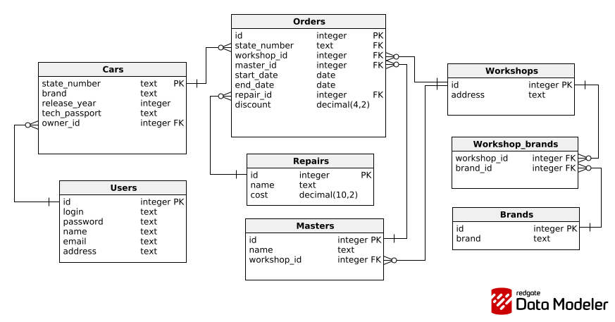

# Схема базы данных

## Диаграмма

## Список таблиц

| Таблица | Назначение | Ключи |
|---------|------------|-------|
| `Users` | Владельцы автомобилей | `id` (PK) |
| `Workshops` | Автомастерские | `id` (PK) |
| `Brands` | Марки автомобилей | `id` (PK) |
| `Masters` | Мастера | `id` (PK), `workshop_id` (FK) |
| `Cars` | Автомобили | `state_number` (PK), `owner_id` (FK) |
| `Repairs` | Виды ремонта | `id` (PK) |
| `Orders` | Выполненные работы | `id` (PK), 4 внешних ключа |
| `Workshop_brands` | Связь мастерских и марок | `workshop_id`, `brand_id` (FK) |

## SQL-скрипт

Скачать SQL-скрипт для создания базы данных: [Workshop_system.sql](./files/DB.sql)