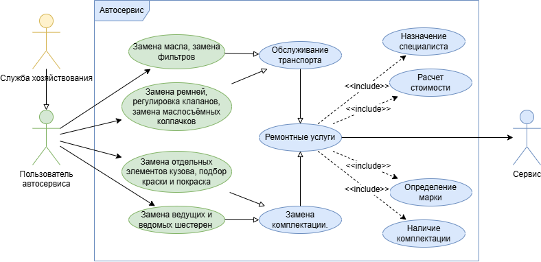

## Диаграмма вариантов использования

### Актёры системы

| Актёр | Описание |
|-------|----------|
| **Служба хозяйствования** | Управляет автосервисом, назначает специалистов, контролирует комплектацию |
| **Пользователь автосервиса** | Работник сервиса, выполняет ремонтные работы |
| **Сервис** | Система, обрабатывающая запросы и предоставляющая услуги |

### Варианты использования

| Вариант использования | Актёр | Описание |
|----------------------|-------|----------|
| Замена элементов кузова, подбор краски и покраска | Пользователь автосервиса | Выполнение кузовных работ |
| Замена ремней, регулировка клапанов, замена маслосъёмных колпачков | Пользователь автосервиса | Работы по двигателю |
| Замена ведущих и ведомых шестерен | Пользователь автосервиса | Ремонт трансмиссии |
| Замена масла, замена фильтров | Пользователь автосервиса | Техническое обслуживание |
| Обслуживание транспорта | Сервис | Базовая услуга сервиса |
| Ремонтные услуги | Сервис | Предоставление ремонта |
| Назначение специалиста | Сервис | Распределение работ между мастерами |
| Определение марки | Сервис | Идентификация автомобиля |
| Наличие комплектации | Сервис | Проверка наличия запчастей |
| Расчёт стоимости | Сервис | Вычисление итоговой цены |
| Замена комплектации | Сервис | Замена неисправных деталей |

### Связи

| Тип | От | К | Описание |
|-----|----|----|----------|
| `<<include>>` | Ремонтные услуги | Назначение специалиста | При ремонте обязательно назначается специалист |
| `<<include>>` | Ремонтные услуги | Определение марки | При ремонте определяется марка авто |
| `<<include>>` | Ремонтные услуги | Наличие комплектации | При ремонте проверяется наличие запчастей |
| `<<include>>` | Ремонтные услуги | Расчёт стоимости | При ремонте рассчитывается стоимость |
| `<<include>>` | Обслуживание транспорта | Ремонтные услуги | Обслуживание включает ремонтные услуги |
| `<<extend>>` | Замена комплектации | Ремонтные услуги | Замена комплектации расширяет ремонтные услуги |