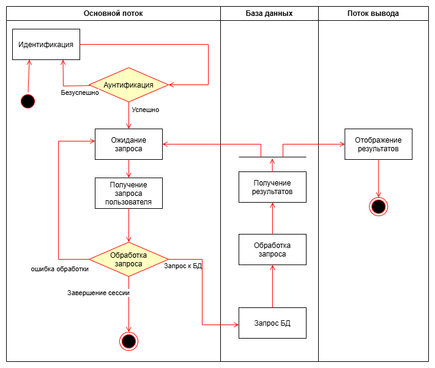
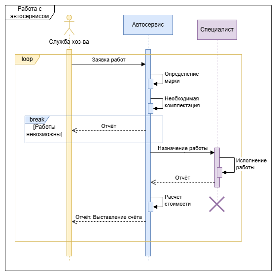

## Диаграмма деятельности (Аутентификация и обработка запросов)

### Описание диаграммы деятельности

Диаграмма показывает процесс обработки запроса пользователя в системе:

| Блок | Действие | Описание |
|------|----------|----------|
| 1 | Идентификация | Пользователь вводит логин и пароль |
| 2 | Аутентификация | Система проверяет учётные данные |
| 3 | Авторизация | Система проверяет права доступа |
| 4 | Ожидание запроса | Система ожидает команду пользователя |
| 5 | Получение запроса | Пользователь вводит запрос |
| 6 | Обработка запроса | Система обрабатывает запрос |
| 7 | Запрос к БД | Система обращается к базе данных |
| 8 | Отображение результатов | Вывод результата пользователю |

### Дорожки

| Дорожка | Что делает |
|---------|-----------------|
| Основной поток | Логика обработки запроса |
| База данных | Хранение и предоставление данных |
| Поток вывода | Отображение результатов пользователю |

## Диаграмма последовательности

### Описание диаграммы последовательности

Диаграмма показывает взаимодействие между автосервисом и службой хозяйствования:

| Участник | Что делает |
|----------|------|
| Служба хозяйствования | Инициирует заявку на работы |
| Автосервис | Обрабатывает заявку, определяет марку, формирует отчёт |

### Блоки

| Блок | Тип | Описание |
|------|-----|----------|
| loop | Цикл | Работа в системе (повторяющиеся действия) |
| Заявка работ | Сообщение | Служба отправляет заявку в автосервис |
| Определение марки | Self-call | Автосервис определяет марку автомобиля |
| Отчёт | Возврат | Автосервис формирует отчёт для службы |